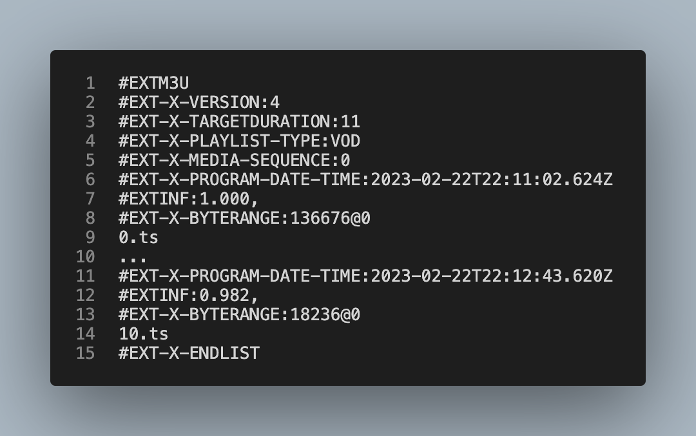
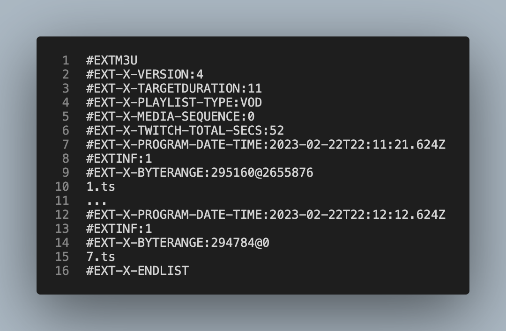

# Amazon IVS manifest clipping: Standalone API
This steps deploys the standalone clipmanifest API **only**. This guide deploys the standalone clipmanifest API **only**. If you already have your application and would like to deploy the API, these are the correct steps you should follow.

## Solution Architecture


## 1. Cloning the Git repository

Clone the git repository of the Clip Manifest API for Amazon IVS:

```
git clone https://github.com/aws-samples/amazon-ivs-clip-manifest.git
```

## Install the lambda packages
```sh
cd standalone-api
cd clipmanifest
npm install
cd ..
```

## Create a deployment bucket or use an existing bucket
If you already have a deployment bucket, jump this step.

```sh
aws s3api create-bucket --bucket <my-bucket-name> --region <my-region>
```

## Create the SAM package
```sh
sam package \
--template-file template.yaml \
--s3-bucket <my-bucket-name> \
--output-template-file packaged.yaml
```

## Deploy the package 
```sh
sam deploy \
--template-file packaged.yaml \
--stack-name sample-clip-manifest \
--capabilities CAPABILITY_IAM
```

## API Usage

#### Create clips API
```sh
curl -X POST <API Gateway Endpoint>/clipmanifest -H "Content-Type: application/json" -d "{\"start_time\": 1,\"end_time\": 15,\"master_url\": \"https://<url of the ivs recording>\"  \"byte_range\": true}"
```

example: 
```sh
curl -X POST https://<unique_ID>.execute-api.us-east-1.amazonaws.com/Prod/clipmanifest/ -H "Content-Type: application/json" -d "{\"start_time\": 1,\"end_time\": 15,\"master_url\": \"https://<unique_ID>.cloudfront.net/ivs/v1/<account_ID>/2rrcA103rn67/2022/10/15/2/11/X5JJ9FegmZiq/media/hls/master.m3u8\" \"byte_range\": true}" 
```

### Test the clip
The new manifest follows the the path URL of the recording with the object called clip_master.m3u8
**Example:** 
  https://<unique_ID>.cloudfront.net/ivs/v1/<account_ID>/2rrcA103rn67/2022/10/15/2/11/X5JJ9FegmZiq/media/hls/clip_master.m3u8

### API Endpoints

#### Clip a manifest recording

Endpoint: `<ApiURL>/clipmanifest`<br />
Method: POST<br />
Content Type: JSON<br />
Payload:
```
{
  "start_time": 0,
  "end_time": 10,
  "master_url": "https://<unique_ID>.cloudfront.net/ivs/v1/<account_ID>/meMi2bja9QD0/2023/2/22/22/11/nft7N9hJhhO5/media/hls/master.m3u8"
  "byte_range": false
}
```
Response Code: 200<br />
Response Body:
```
[{"execution":1677108136560,"path":"/ivs/v1/<account_ID>/meMi2bja9QD0/2023/2/22/22/11/nft7N9hJhhO5/media/hls","bucket":"my-new-ivs-recording-bucket-standalone-api<account_ID>","clip_master":"my-new-ivs-recording-bucket-standalone-api<account_ID>/ivs/v1/<account_ID>/meMi2bja9QD0/2023/2/22/22/11/nft7N9hJhhO5/media/hls/1677108136560_clip_master.m3u8","master_url":"https://<unique_ID>.cloudfront.net/ivs/v1/<account_ID>/meMi2bja9QD0/2023/2/22/22/11/nft7N9hJhhO5/media/hls/1677108136560_clip_master.m3u8"}]
```


## 8. Testing the clipmanifest API 

After completing a live transmission to your Amazon IVS RTMPS endpoint, navigate to the Amazon S3 Recording Bucket, and look for the .m3u8 manifest. The Amazon S3 path should look like the below:

````
/ivs/v1/<aws_account_id>/<channel_id>/<year>/<month>/<day>/<hours>/<minutes>/<recording_id>/media/hls/720p30/playlist.m3u8
````




## 9. Using the create clips API

Make an HTTP Post call to the Amazon API Gateway endpoint.

```sh
curl -X POST <API Gateway Endpoint>/clipmanifest -H "Content-Type: application/json" -d "{\"start_time\": 1,\"end_time\": 15,\"master_url\": \"https://<url of the ivs recording>\" \"byte_range\": true}"
```

Example: 
```sh
curl -X POST https://nopxir0z9i.execute-api.us-east-1.amazonaws.com/Prod/clipmanifest/ -H "Content-Type: application/json" -d "{\"start_time\": 1,\"end_time\": 15,\"master_url\": \"https://<cloudfront_dist_id>.cloudfront.net/ivs/v1/<account_id>/2rrcA103rn67/2022/10/15/2/11/X5JJ9FegmZiq/media/hls/master.m3u8\" \"byte_range\": true}" 
```

### 10. Test the clip

The new manifest follows the path URL of the recording with the object called clip_master.m3u8



[Return to home page of the solution](../README.md)
